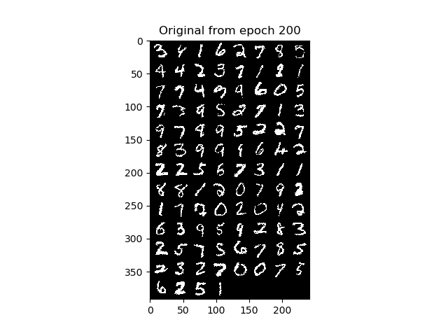
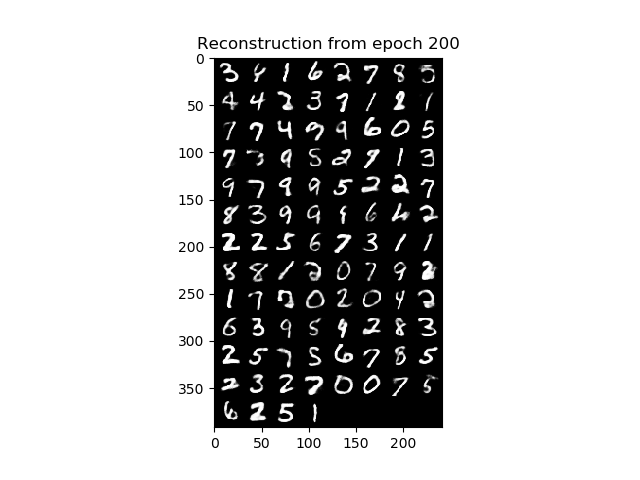

## Variational Autoencoders with Normalizing Flows (only Planar Flows)

Personal implementation of the paper *Rezende, Danilo Jimenez, and Shakir Mohamed. "Variational inference with normalizing flows." by Rezende, D. J., & Mohamed, S. (2015).*. 
The main purpose of this repository is to make the paper implementation accessible and clear to people
that just started getting into Variational Autoencoders without having to look into highly optimized and difficult to 
search libraries.

I use the hyperparameters of the paper: every MLP has only one hidden layer with 400 hidden units, the dimension
of the latent space is 40 and I use 10 Planar Flows. Also in this case I trained only for 200 epochs. I consider amortized weights
for the flows. The log-likelihood on the test set is -92.0902.

### Reconstruction examples after 200 epochs, z_dim = 40, MLP with one layer (400 units), 10 Planar Flows

TODO: this is far from being a complete repo. There are some changes I am still want
make during my free time:
1. learn how to sample when using amortized weights and then train until convergence using a GPU
2. create more functions to avoid repeated code
3. print more infos during training
4. using another dataset other than MNIST
5. add argparse